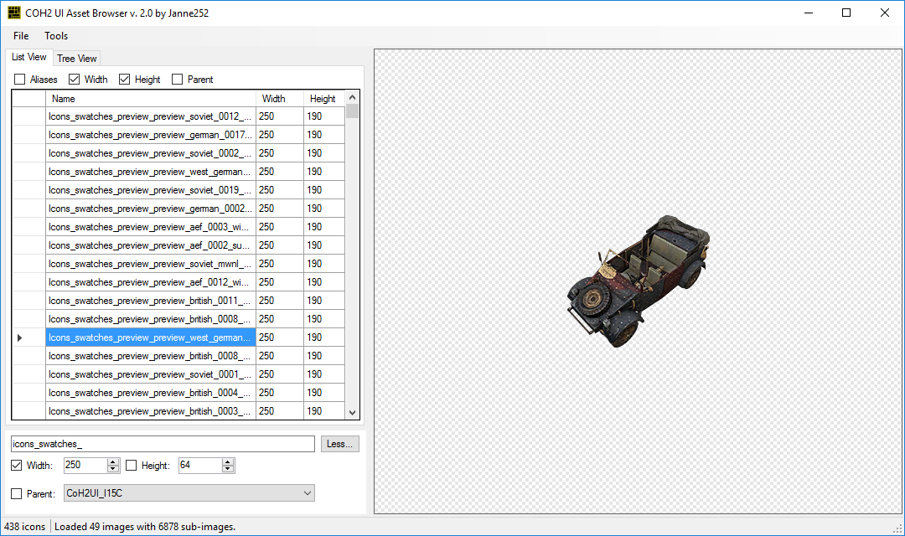

# CoH2 UI Asset Browser

A tool for browsing and extracting UI assets from Company of Heroes 2.    
Originally released on [COH2.ORG](https://www.coh2.org/topic/30322/tool-coh2-ui-asset-browser) on February 1st, 2015. 

### Usage
- Requirements
	- Company of Heroes 2
	- [Company of Heroes 2 Tools](http://modding.companyofheroes.com/mod-builder)
	- [.NET 4.5.2 runtime](https://dotnet.microsoft.com/en-us/download/dotnet-framework/net452)
1. Launch Company of Heroes 2 Tools and open Archive Viewer by clicking "Tools" -> "Archive Viewer"
1. In Archive Viewer, click "File" -> "Open" and select `\SteamLibrary\steamapps\common\Company of Heroes 2\CoH2\Archives\UIHigh.sga` as the file to open.
1. In Archive Viewer, right-click the first entry `UIHigh.sga` on the tree view and select "Extract". Select a destination folder for extracting the files, e.g. `C:\Users\<YOU>\Documents\CoH2UIAssets`. This example path will be used throughout this tutorial. If you chose a different path, use it instead whenever this path is referenced in this tutorial.
1. You'll get the following error: 
	> Error extracting UIHigh.sga:
	> Error reading data for file placeholder.
	
	Click "OK" to continue.
1. In Archive viewer, expand the tree view on the left: `data` -> `ui` -> `bin`, right-click `coh2ui.gfx` and select "Extract". Choose `C:\Users\<YOU>\Documents\CoH2UIAssets\data\ui\bin` as the destination path. Make sure to create the missing `bin` folder!
1. Download the latest `Janne252.COH2.UIAssetBrowser.zip` from [releases](https://github.com/Janne252/coh2-ui-asset-browser/releases), extract it somewhere and launch `janne252.COH2.UIAssetBrowser.exe`.
1. Click "File" -> "Open" and navigate to `C:\Users\<YOU>\Documents\CoH2UIAssets\data\ui\bin` and select `coh2ui.gfx` as he file to open.
1. You should now be able to browse and extract Company of Heroes 2 UI assets.
